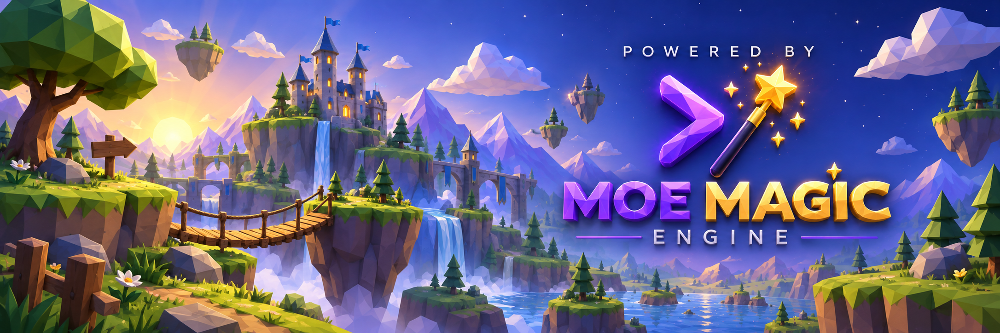

  

  

<h1 align="center">Moe Magic Engine</h1>

  A lightweight Windows-first 3D game engine and visual editor for building games with component-based authoring, Lua scripting, physics, animation, audio, UI, particles, and standalone Windows builds.

  <a href="https://github.com/mra1991/MoeMagicEngine/releases/latest"><strong>Download the latest release</strong></a>
  ·
  <a href="https://patreon.com/MoeMagicEngine"><strong>Support on Patreon</strong></a>

---

## ✨ What is Moe Magic?

**Moe Magic Engine** is an independently developed 3D game engine for Windows.

It is designed around a straightforward workflow:

**Create a project → build scenes visually → add reusable Components → write game logic in Lua → Play → Build Game.**

You do **not** need the engine source code, Visual Studio, or C++ to make a game with Moe Magic. Normal gameplay scripting is done in **Lua**.

The engine itself is proprietary, but it is **free to use with no royalties or revenue threshold** for personal, educational, free, and commercial games.

## 🎮 Highlights

- Visual Scene editor with Hierarchy, Inspector, transform gizmos, Scene/Game views, camera guides, and viewport orientation tools
- Component-based GameObjects
- OBJ and supported JSON glTF model import
- Skeletal animation
- Materials, PBR lighting, shadows, HDR, bloom, transparency, and graphics-quality presets
- Static, Dynamic, and Kinematic physics
- Capsule Character Controller and moving-platform support
- Keyboard and gamepad Input Actions with runtime rebinding
- 2D and spatial 3D audio
- Canvas UI, menus, HUDs, buttons, and graphical UI images
- Particle bursts and scripted effects
- Project-local Lua gameplay scripting
- Play / Pause / Step / Stop workflow
- Multi-scene projects and scene transitions
- Build Game for standalone Windows players
- Built-in offline User Manual and two complete game tutorials
- Bundled CC0 starter asset library

## 🕹 Included sample projects

### Ultimate Platformer

A third-person platforming game demonstrating:

- character movement and camera-relative controls
- animation
- physics and pushable objects
- moving ferries
- coins and health pickups
- enemies and hazards
- particles and spatial audio
- Lua-driven gameplay
- menus, HUDs, and standalone builds

### Pot Pursuit

A timed collection game demonstrating:

- project-owned scoring and objectives
- moving hazards
- timed collectibles
- spatial and 2D audio
- animated menu presentation
- Canvas UI
- Lua gameplay logic
- complete menu → gameplay → result flow

## 📦 Installation

Moe Magic currently targets **64-bit Windows 10/11**.

1. Open the [latest GitHub Release](https://github.com/mra1991/MoeMagicEngine/releases/latest).
2. Download `MoeMagicEngine-<version>-Setup.exe`.
3. Run the installer.
4. Launch **Moe Magic Engine** from the Start Menu or optional Desktop shortcut.
5. Create a Basic 3D project or copy/open one of the included sample projects.

The installer includes the Editor, compatible Player template, documentation, sample projects, templates, and the selected CC0 starter library.

> Windows may show an **Unknown Publisher / SmartScreen** warning while the installer is unsigned. Always verify the published SHA-256 checksum if you want to confirm the download.

## 📚 Documentation

Moe Magic includes offline documentation accessible directly from:

**Help → User Manual**

The documentation includes:

- the complete engine User Manual
- an Ultimate Platformer tutorial
- a Pot Pursuit tutorial
- Lua scripting guidance
- authoring, physics, animation, audio, UI, particles, input, and Build Game instructions

## 🧰 Starter asset library

The installer includes a curated CC0 starter library built from compatible assets by **Kenney**, **Quaternius**, and other CC0 audio creators.

The starter library is intentionally separate from your projects. Copy the assets you want into your own project's `assets/` folder so projects remain self-contained and Build Game packages only their actual dependencies.

Third-party assets retain their original licenses and provenance notices.

## 💜 Support Moe Magic

Moe Magic is independently developed by **Mohammadreza (Moe) Abolhassani**.

If you enjoy the engine and want to support continued development, documentation, examples, and future versions:

### ⭐ [Support Moe Magic on Patreon](https://patreon.com/MoeMagicEngine)

There are no royalties or revenue thresholds for games made with Moe Magic.

## 📜 License

Moe Magic Engine is **free proprietary software**, not open source.

In summary:

- You may use the supplied engine binaries for personal, educational, free, or commercial games.
- You keep ownership of your own game content and code.
- You may distribute the required Moe Magic Player/runtime with games built using Moe Magic.
- The built-in Moe Magic startup branding and required notices must remain intact.
- The Editor and engine source may not be redistributed or rebranded as another engine product without permission.
- Bundled third-party assets remain governed by their own licenses.

See [`LICENSE.txt`](LICENSE.txt) for the full terms.

## 💻 Current release

**v0.12.8 — First Public Release**

The v0.12.8 installer is approximately **57 MB** and includes the public-facing installed engine experience, sample projects, documentation, and a curated starter library of roughly **155 MB uncompressed**.

SHA-256 checksums are published alongside release downloads.

## 🪄 Development history

Moe Magic has been built incrementally, with each version family establishing another part of the engine:

| Family | Main focus |
| --- | --- |
| **v0.0.x** | Core architecture, rendering, GameObjects, assets, lighting, hierarchy, and Scene persistence |
| **v0.1.x** | Interactive editor workflow, viewport tools, undo/redo, and docked workspace |
| **v0.2.x** | Play Mode, runtime isolation, native Behaviours, input, destruction, cameras, and triggers |
| **v0.3.x** | Early complete gameplay workflows, licensed model library, Scene usability, and prefabs |
| **v0.4.x** | Standalone Player foundation and portable Windows development builds |
| **v0.5.x** | Rigid-body physics, collider shapes, Kinematic motion, spatial queries, and Character Controller |
| **v0.6.x** | Input Actions, gamepad support, Canvas UI, fullscreen Player presentation, and rebinding |
| **v0.7.x** | 2D audio, spatial audio, listener support, and gameplay-driven sound |
| **v0.8.x** | glTF import, skeletal animation, Scene transitions, and authored Main Menu flow |
| **v0.9.x** | Rendering and presentation: lighting, shadows, PBR, HDR, bloom, particles, and quality presets |
| **v0.10.x** | Embedded Lua gameplay scripting and progressively richer user-side APIs |
| **v0.11.x** | Project workflows, recovery, project-scoped operations, dependency diagnostics, and asset reload |
| **v0.12.x** | Project-owned gameplay, multi-project workflow, user documentation, installer, sample projects, and public-distribution readiness |

The next major milestone is **v1.0.0**: the stable conventional engine foundation before future v2 AI-assisted development work.

---

  <strong>Moe Magic Engine</strong> 
  Developed by Mohammadreza (Moe) Abolhassani

